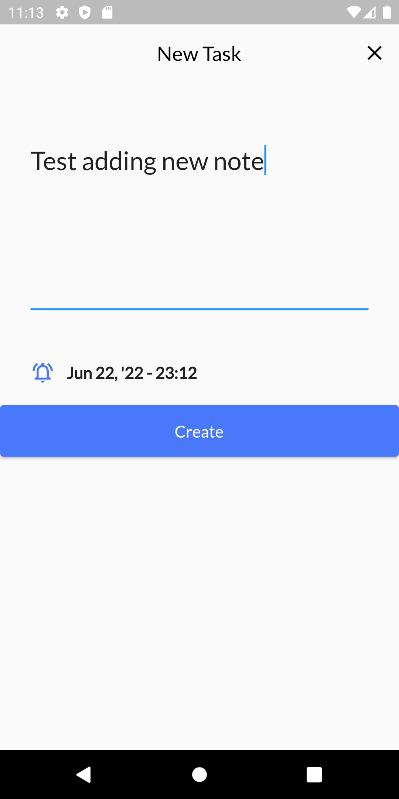

# Flutter · TODO web and mobile app


To-do List app using with Firebase, using RiverPod as state management and dependency injection.

### Below there are a few instructions about mandatory commands to be run in order to facilitate the work.

### Build the docker image

Use docker build the container image

```bash
docker build -t up .
```

If you have some problem during cache, you can clean cache by this

```bash
docker build --no-cache -t up .
```

### After Success building image

Run the docker image with localhost 1200 port. You can change to any other port just replace it.

```bash
docker run -d -p 8080:80 --name todoapp up
```

### to run project unit test and widget test use

```bash
flutter test
```

#### Testing coverage


### Firebase Scheme

    ├── todos
      ├── id (generated)
        ├── finalDate (Number)
        ├── isCompleted (Boolean)
        ├── subject (String)

### Project Architecture

- Remote Service : managing remote connection with firebase
- Repository : talking to data sources to prepare the data
- ViewModel : Managing differnet ui states and provide streams for ui
- UI : presentation layer containing Screens and custom widgets used in the app

### Navigator 2.0

Actually the project has been implemented with **Navigator 2.0** or **Route API**.

### Responsive and Adaptive

This To-do app project uses responsive and adaptive principles to use it on different screen sizes
and any devices, like mobile phones, tablets, computers, notebooks, etc.

### Project screenshots

<table>
  <tr>
    <td></td>
    <td></td>
  </tr>
<tr>
    <td></td>
    <td></td>
  </tr>
<tr>
    <td></td>
    <td></td>
</tr>
<tr>
    <td></td>
  </tr>
<tr>
    <td></td>


</tr>
<tr>
   img src="readme_images/web2.png" width=900 height=900></td>
</tr>
<tr>
    <td></td>
</tr>


 </table>


